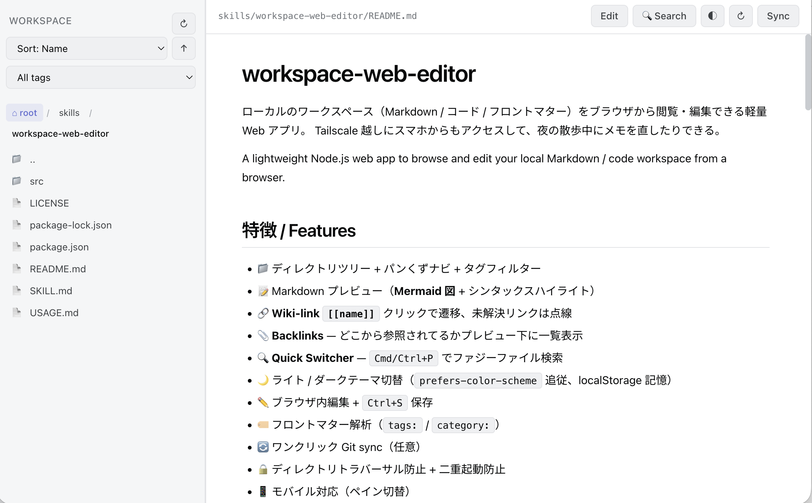
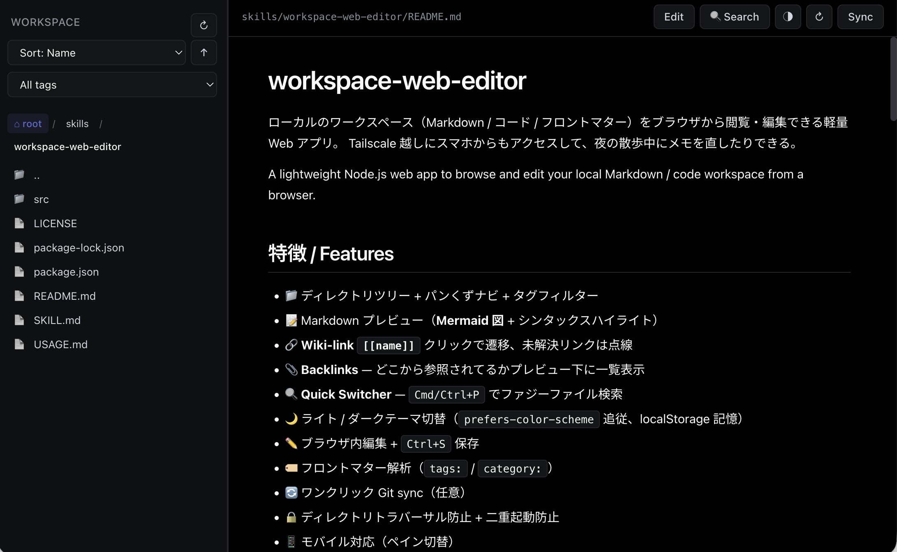
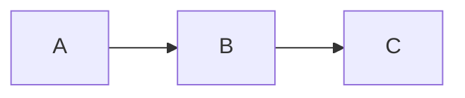

# workspace-web-editor

ローカルのワークスペース（Markdown / コード / フロントマター）をブラウザから閲覧・編集できる軽量 Web アプリ。
Tailscale 越しにスマホからもアクセスして、夜の散歩中にメモを直したりできる。

A lightweight Node.js web app to browse and edit your local Markdown / code workspace from a browser.

## 特徴 / Features

- 📁 ディレクトリツリー + パンくずナビ + タグフィルター
- 📝 Markdown プレビュー（**Mermaid 図** + シンタックスハイライト）
- 🔗 **Wiki-link `[[name]]`** クリックで遷移、未解決リンクは点線
- 📎 **Backlinks** — どこから参照されてるかプレビュー下に一覧表示
- 🔍 **Quick Switcher** — `Cmd/Ctrl+P` でファジーファイル検索
- 🌙 ライト / ダークテーマ切替（`prefers-color-scheme` 追従、localStorage 記憶）
- ✏️ ブラウザ内編集 + `Ctrl+S` 保存
- 🏷️ フロントマター解析（`tags:` / `category:`）
- 🔄 ワンクリック Git sync（任意）
- 🔒 ディレクトリトラバーサル防止 + 二重起動防止
- 📱 モバイル対応（ペイン切替）

## スクリーンショット

| Light | Dark |
|---|---|
|  |  |

## 必要環境

- Node.js 18+
- ブラウザ
- (任意) Tailscale — スマホ等からアクセスする場合

## セットアップ

```bash
git clone https://github.com/karaage0703/workspace-web-editor.git
cd workspace-web-editor
npm install
WORKSPACE_DIR=/path/to/your/workspace PORT=9080 node src/server.js
```

ブラウザで `http://localhost:9080/` を開く。

詳しい使い方は **[USAGE.md](./USAGE.md)** を参照。

### 環境変数 / Environment variables

| 変数 | デフォルト | 説明 |
|------|-----------|------|
| `WORKSPACE_DIR` | `process.cwd()` | 閲覧するワークスペースのルート |
| `PORT` | `9080` | リッスンするポート |
| `EXCLUDE_EXTRA` | （なし） | デフォルト除外に追加するディレクトリ名（カンマ区切り） |
| `VIEWABLE_EXT` | `.md,.txt,.json,.yaml,.yml,.toml,.py,.js,.ts,.sh` | 表示対象の拡張子をカンマ区切りで上書き |

### systemd サービス（自動起動）

`workspace-web-editor.service` をコピーして編集 → 有効化：

```bash
sudo cp workspace-web-editor.service /etc/systemd/system/
sudo vim /etc/systemd/system/workspace-web-editor.service  # WORKSPACE_DIR を編集
sudo systemctl daemon-reload
sudo systemctl enable --now workspace-web-editor
```

## 対応ファイル

デフォルトで `.md`, `.txt`, `.json`, `.yaml`, `.yml`, `.toml`, `.py`, `.js`, `.ts`, `.sh`

`.md` ファイルはフロントマター（`tags:` / `category:`）を解析してタグでフィルターできる。

## Mermaid

````markdown

````

ライト / ダーク切替に追従して図のテーマも変わる。

## Wiki-link

```markdown
ここを見て: [[my-note]]
表示テキスト変えたい時: [[my-note|別名]]
```

ファイル名（拡張子なし）が一致するファイルへ遷移。リンク先がない時は点線で表示。

## API

| メソッド | パス | 用途 |
|---------|------|------|
| GET | `/api/files?dir=&sort=&order=&tag=` | ディレクトリ一覧 |
| GET | `/api/files/:path` | ファイル読み込み |
| PUT | `/api/files/:path` | ファイル保存（JSON: `{content}`） |
| GET | `/api/all-files` | 全ファイル平坦リスト（Quick Switcher 用） |
| GET | `/api/tags` | タグ一覧（出現数付き） |
| GET | `/api/backlinks?path=X` | X への被リンク一覧 |
| GET | `/api/resolve?name=X` | wiki-link 名解決 |
| POST | `/api/sync` | `git pull && git add -A && git commit && git push` |

## 除外パターン

`node_modules`, `.git`, `__pycache__`, `.venv`, `venv` をデフォルトで除外。
`.` で始まるファイル / ディレクトリは全部除外。

追加で除外したい場合は `EXCLUDE_EXTRA` 環境変数で指定：

```bash
EXCLUDE_EXTRA=archives,build,dist node src/server.js
```

## セキュリティ

- ディレクトリトラバーサル防止（`WORKSPACE_DIR` 外へのアクセスは 403）
- 二重起動防止（PID ファイル）
- **認証機構は無い** — Tailscale や VPN 越しの個人利用が前提。**公開ネットワークに直接晒さないこと**

## 謝辞 / Acknowledgments

以下の OSS の上に成り立っている：

- [hawkymisc/mdview](https://github.com/hawkymisc/mdview) — ダークモード / Mermaid 実装の参考
- [Express](https://expressjs.com/) — Web server
- [marked](https://marked.js.org/) — Markdown parser
- [highlight.js](https://highlightjs.org/) — Syntax highlighting
- [Mermaid](https://mermaid.js.org/) — Diagram rendering
- [Pico CSS](https://picocss.com/) — Lightweight CSS framework

## ライセンス / License

MIT — see [LICENSE](LICENSE)
