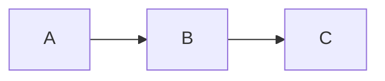

# Usage / 使い方

ブラウザを開いて `WORKSPACE_DIR` 配下の Markdown / コードファイルを閲覧・編集するだけのシンプルな Web アプリ。Tailscale 越しに使えば、スマホからもメモを編集できる。

A simple browser-based viewer/editor for your local workspace. Pair with Tailscale and you can edit your notes from your phone.

---

## 起動 / Launch

```bash
WORKSPACE_DIR=/path/to/your/workspace PORT=9080 node src/server.js
```

| 環境変数 | デフォルト | 説明 |
|---|---|---|
| `WORKSPACE_DIR` | `process.cwd()` | 閲覧・編集するワークスペースのルート |
| `PORT` | `9080` | ポート番号 |
| `EXCLUDE_EXTRA` | （なし） | 追加で除外するディレクトリ名（カンマ区切り） |
| `VIEWABLE_EXT` | `.md,.txt,...` | 表示対象の拡張子（カンマ区切りで上書き） |

### よくある起動例

**大規模ワークスペース（アーカイブを除外）**:
```bash
WORKSPACE_DIR=/home/me/notes EXCLUDE_EXTRA=archives,backups,information-hub node src/server.js
```

**プロジェクト単位（ビルド成果物を除外）**:
```bash
WORKSPACE_DIR=/path/to/project EXCLUDE_EXTRA=dist,build,coverage node src/server.js
```

**Markdown だけに絞る**:
```bash
WORKSPACE_DIR=/path/to/notes VIEWABLE_EXT=.md node src/server.js
```

---

## ブラウザでアクセス

```bash
echo "http://localhost:$PORT"

# Tailscale 経由（スマホ等から）
echo "http://$(tailscale ip -4):$PORT"
```

---

## 操作 / Operations

### キーボードショートカット

| キー | 動作 |
|---|---|
| `Cmd/Ctrl + P` | Quick Switcher を開く（ファジーファイル検索） |
| `↑` / `↓` | Quick Switcher の候補を上下移動 |
| `Enter` | 選択ファイルを開く |
| `Esc` | Quick Switcher を閉じる |
| `Cmd/Ctrl + S` | 編集中のファイルを保存 |

### ツールバーボタン

- **☰** モバイル表示でファイル一覧を開く
- **Edit** プレビュー → エディタに切り替え
- **Save** 保存（プライマリ色）
- **🔍 Search** Quick Switcher を開く（`Ctrl/Cmd + P` でもOK）
- **◐ / ◑** ライト/ダーク切替
- **↻** **現在のディレクトリと開いているファイル**を再読み込み（ホームには戻らない）
- **Sync** Git pull → commit → push（任意、上述参照）

### サイドバー

- **Sort** ファイル一覧を「名前」「更新日」で並び替え
- **↑ / ↓** 昇順 / 降順切替
- **All tags** フロントマターの `tags:` でフィルター
- **Breadcrumb** クリックで上位ディレクトリに移動

---

## Markdown 拡張機能 / Extensions

### Mermaid 図

````markdown

````

ライト / ダーク切替に追従して図のテーマも変わる。

### Wiki-link `[[name]]`

```markdown
あのメモも見て: [[my-note]]
表示テキストを変える: [[my-note|別名で表示]]
```

- ファイル名（拡張子なし）が一致するファイルへ遷移
- リンク先が見つからない場合は **点線（broken）** で表示

### Backlinks

ファイルを開くと、プレビュー下部に「📎 Backlinks」セクションが自動表示。

- どこから参照されているかが一覧で見える
- `[[ ]]` Wiki-link / `[md]` Markdown link / `[[ ]]+md` 両方の3種類のバッジ

### フロントマター

ファイルの先頭に：

```markdown
---
title: ノートのタイトル
date: 2026-05-04
tags: [project, idea]
category: notes
---
```

→ プレビュー上部にメタデータピル形式で表示、サイドバーの **All tags** でフィルター可。

---

## Sync ボタンについて / Git Sync

ツールバー右端の `Sync` ボタンは、ワークスペースが Git リポジトリの場合に **pull → add → commit → push を一気に実行**するショートカット。

### 内部で実行されるコマンド

```bash
cd $WORKSPACE_DIR \
  && git pull \
  && git add -A \
  && git commit -m "Sync from workspace-web-editor" \
  && git push
```

### 想定する使い方

- スマホから Tailscale 越しでメモを編集 → `Ctrl+S` で保存 → `Sync` で GitHub にバックアップ
- AI エージェントが裏で書いた変更も含めて、まとめて1ボタンで push

### 注意点

- **`git add -A` なので、ブラウザ外で行った変更も全部巻き込む**（不要な変更があれば事前に `.gitignore` で除外しておく）
- **コミットメッセージは固定** `"Sync from workspace-web-editor"`（細かいメッセージを付けたい時はターミナルで手動コミット推奨）
- **`WORKSPACE_DIR` が Git リポジトリでないとエラー**になる
- **push 認証が通る状態**である必要あり（SSH 鍵 / `gh auth` / credential helper など）
- **エラーは UI には出ない**（サーバ側のログを見て）。ボタンが赤くなるだけ
- 「コミットするものがない」場合はエラーにならず成功扱い

### 使わない選択肢

Git 管理下にないワークスペースや、Sync を使わない運用なら **ボタンを触らなければ何も起きない**ので無害。

---

## AI エージェントとの併用 / AI agent workflows

Claude Code / Codex などの AI エージェントが裏でファイルを書き換えるワークスペースで使うと便利：

1. AI エージェントがファイル更新
2. ブラウザで `↻` リロード（or 手動でファイルを開き直し）
3. 内容を確認して気になる箇所を編集 → `Ctrl+S` で保存
4. `Sync` ボタンで GitHub に push

---

## トラブルシューティング / Troubleshooting

### 起動しない / 既に起動中エラー

```
❌ workspace-web-editor is already running (PID: ...)
```

→ 既存プロセスが生きている。`pkill -f "workspace-web-editor.*server.js"` で停止してから再起動。
PID ファイルが残ってるだけなら `rm .workspace-web-editor.pid`。

### Quick Switcher が遅い

ワークスペースのファイル数が多すぎる。`EXCLUDE_EXTRA` で archives / backups などを除外して再起動。

### Mermaid が描画されない

ブラウザの **強制リロード**（`Ctrl + Shift + R` / `Cmd + Shift + R`）で再ロード。
ブラウザコンソール（F12）に `[workspace-web-editor] mermaid loaded` が出ているか確認。

### Wiki-link が点線（broken）になる

リンク先のファイル名（拡張子なし）が、ワークスペース内のどこかに存在する `.md` ファイルと一致するか確認。
完全一致のみ（fuzzy match なし）。

### 編集後に保存できない

サーバ側のファイル書き込み権限を確認。`WORKSPACE_DIR` 配下が書き込み可能である必要がある。

### Git Sync が失敗する

`POST /api/sync` は内部で `git pull && git add -A && git commit -m "..." && git push` を実行。
`WORKSPACE_DIR` が Git リポジトリで、 push 先が認証済みである必要がある。

---

## API（外部から叩きたい人向け）

| メソッド | パス | 用途 |
|---|---|---|
| `GET` | `/api/files?dir=&sort=&order=&tag=` | ディレクトリ一覧 |
| `GET` | `/api/files/:path` | ファイル読み込み |
| `PUT` | `/api/files/:path` | 保存（JSON: `{content}`） |
| `GET` | `/api/all-files` | 全ファイル平坦リスト |
| `GET` | `/api/tags` | タグ一覧（出現数付き） |
| `GET` | `/api/backlinks?path=X` | X への被リンク一覧 |
| `GET` | `/api/resolve?name=X` | wiki-link 名解決 |
| `POST` | `/api/sync` | Git sync |

---

## セキュリティ / Security

- **認証なし** — Tailscale や VPN 越しの**個人利用が前提**
- **公開ネットワークに直接晒さないこと**
- ディレクトリトラバーサル防止（`WORKSPACE_DIR` 外へのアクセスは 403）
- 保存はサーバ側の権限で書き込み実行されるので、信頼できないネットワークから操作させない
